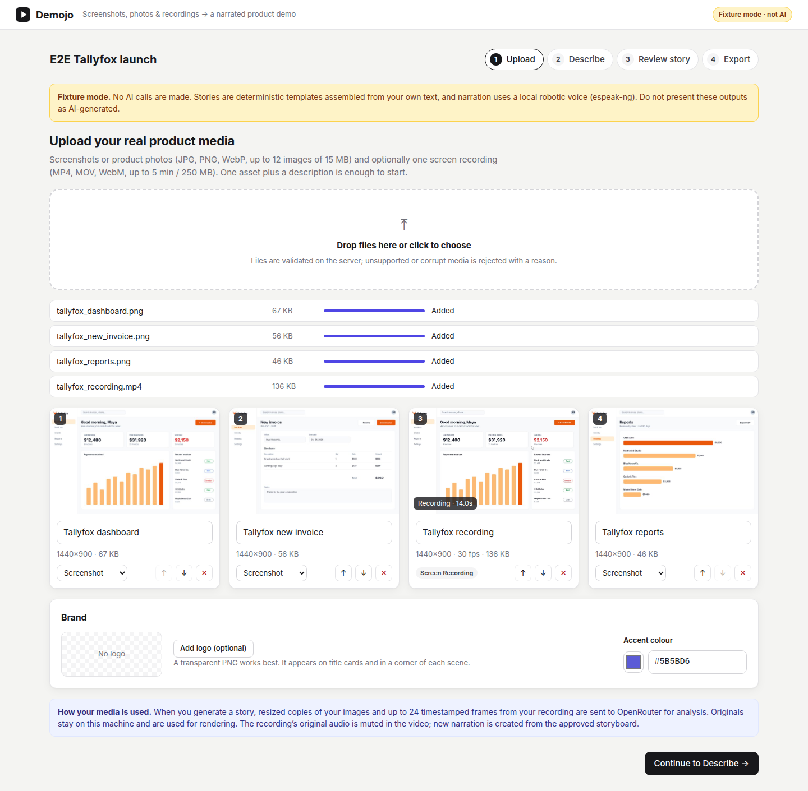
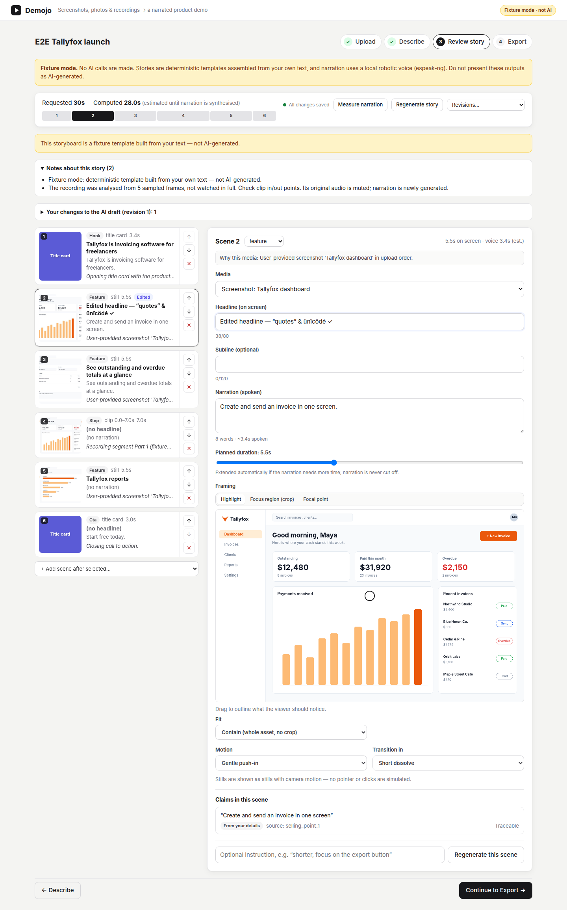

# Demojo

**Turn product screenshots, photos, and rough screen recordings into a polished, narrated product demo video.**

Demojo is a local prototype for validating the idea with real customers:

1. **Upload** your real product screenshots, product photos, and/or one screen recording.
2. **Describe** the product: facts, audience, selling points, CTA, style, duration, and aspect ratio.
3. **Review story.** An AI-drafted storyboard grounded in what you provided. Every scene is editable (copy, media, clip in/out, framing and highlight, motion), and claims that can't be traced to your inputs need your confirmation before export.
4. **Export** an MP4 (1080p/30 fps, 16:9 or 9:16) with AI narration, plus the script, SRT captions, and storyboard JSON.

The core export needs no generative-video API. The motion comes from your actual assets (restrained camera moves, highlights, title cards, and real recording segments), and the only paid AI provider is OpenRouter.

> **Status (25 Sep 2026):** Working end to end, verified live against OpenRouter (a real project costs about $0.013), with 74 backend tests, a browser test, and CI/CD on GitHub Actions.
> See [docs/VERIFICATION.md](docs/VERIFICATION.md) and [docs/MODELS.md](docs/MODELS.md).

## Quick start (Docker Compose, reference setup)

```bash
cp .env.example .env          # then set OPENROUTER_API_KEY=... (server-side only)
docker compose up --build     # API/UI + worker, same image, shared data volume
open http://127.0.0.1:8000
```

- **Data** persists in the `demojo-data` volume across restarts.
- **Port binding:** the UI is bound to `127.0.0.1` only. There's no login, so don't expose it publicly.
- **Docker Hub rate limits:** if pulls are rate-limited, add
  `--build-arg NODE_IMAGE=mirror.gcr.io/library/node:22-bookworm-slim --build-arg PYTHON_IMAGE=mirror.gcr.io/library/python:3.11-slim-bookworm`.
- **Check your key and models:** `docker compose run --rm worker demojo diagnose`.

## Native development

Requirements: Python 3.11, [uv](https://docs.astral.sh/uv/), Node 22, `ffmpeg`/`ffprobe`. Install `espeak-ng` too if you want the offline fixture voice.

```bash
cp .env.example .env                       # add OPENROUTER_API_KEY
cd frontend && npm ci && npm run build     # FastAPI serves frontend/dist
cd ../backend && uv sync
uv run demojo diagnose                     # checks key, models, voice, pricing (never prints the key)
uv run demojo serve                        # terminal 1: API + UI on http://127.0.0.1:8000
uv run demojo worker                       # terminal 2: the job worker (required)
```

For UI work, run `npm run dev` in `frontend/` (http://127.0.0.1:5173, which proxies `/api` to :8000).

## Configuration (`.env`)

| Variable | Default | Notes |
|---|---|---|
| `OPENROUTER_API_KEY` | — | The only secret. Read by the backend only. |
| `OPENROUTER_VISION_MODEL` | `google/gemini-3.1-flash-lite` | Must accept images and support structured outputs. |
| `OPENROUTER_STORY_MODEL` | `google/gemini-3.1-flash-lite` | Must support structured outputs. |
| `OPENROUTER_TTS_MODEL` / `OPENROUTER_TTS_VOICE` | `hexgrad/kokoro-82m` / `af_heart` | The voice must be in the model's `supported_voices`. |
| `DATA_DIR` | `./data` | SQLite database and all media. |
| `MAX_UPLOAD_MB` | `350` | Per project. Other limits: 12 images of ≤15 MB (≤40 MP decoded) and one recording of ≤5 min / 250 MB. |
| `AI_PROJECT_BUDGET_USD` | `3` | App-side guard, not a provider cap. Also set a credit limit on your OpenRouter key. |
| `ENABLE_GENERATIVE_BROLL` | `false` | The optional extension is deferred (see Architecture). |
| `DEMOJO_PROVIDER_MODE` | `openrouter` | `fixture`: no AI calls, deterministic templates, and a robotic espeak-ng voice, all clearly labelled. |

## Fixtures, smoke test, samples

The synthetic fixture assets use fictional brands, contain no private data, and require no paid API call:
- **Tallyfox** (invoicing app): three screenshots, a 14-second screen recording, and a logo.
- **Aurel** (bottle): three illustrated product views and a logo.

```bash
cd backend
uv run demojo fixtures                                   # regenerate ../fixtures deterministically
uv run demojo smoke --case all --aspect both             # offline end-to-end renders (fixture mode) into ../samples
uv run demojo smoke --case mixed --aspect 9:16 --quality final
uv run demojo smoke --live --case mixed --aspect 16:9     # real OpenRouter calls (~$0.015)
```

`samples/` contains four 1080p renders from the smoke test, each with its storyboard, script, and captions:
- images-only 16:9
- recording-only 9:16
- mixed 16:9
- mixed 9:16

**These samples are fixture outputs.** The storyboards are deterministic templates built from the fixture brief, and the narration is espeak-ng, not AI. They demonstrate the renderer, not the AI story quality.

## Tests

```bash
cd backend && uv run pytest -q                      # 74 tests; renders real video (~5 min)
uv run pytest -q -m "not render"                    # fast subset
cd ../frontend && npm run build && npm run e2e      # browser test: upload → storyboard edit → export → download
```

## Screenshots

| Upload | Review story |
|---|---|
|  |  |

## Documentation

- [docs/ARCHITECTURE.md](docs/ARCHITECTURE.md): modules, storyboard contract, rendering, jobs, storage, security.
- [docs/MODELS.md](docs/MODELS.md): verified model IDs, date checked, pricing and cost assumptions, live status.
- [docs/VERIFICATION.md](docs/VERIFICATION.md): what was tested and inspected, results, known limitations, next steps.
